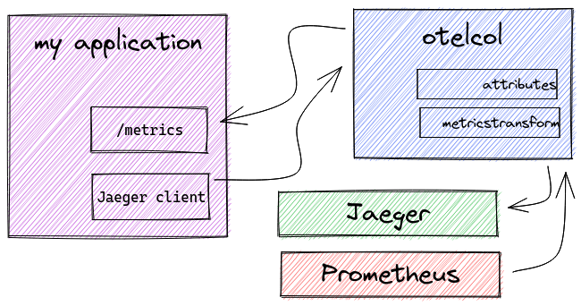
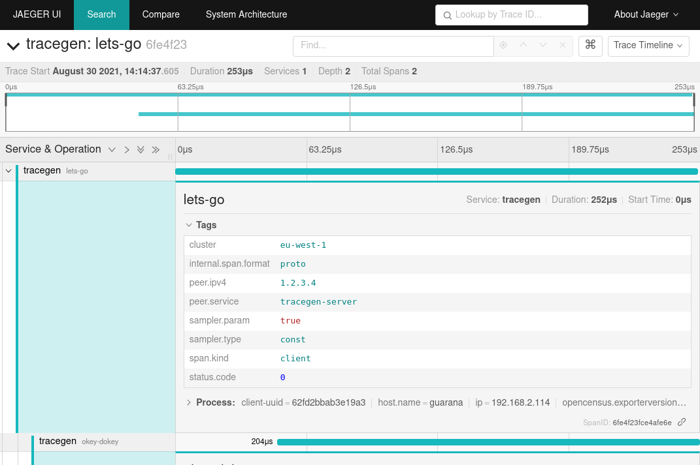
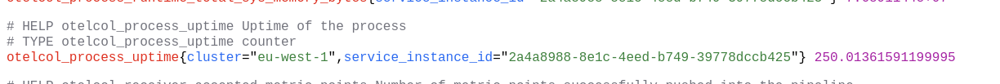

= Pattern #2 - Normalizer

This pattern features a scenario where the instrumentation might have been done with one library per signal, such as Prometheus for OpenMetrics and OpenTracing with a Jaeger tracer for traces. Because each one of those instrumentation libraries might collect different labels based on the environment data, we might need to normalize them to a common set, name and/or format.

.Normalizer pattern.

.Normalizer running on traces, adding a 'cluster' tag to the span.

.Normalizer running on metrics, adding a 'cluster' tag to the metric `otelcol_process_uptime`.

== Running

You'll need an application that generates both metrics and traces. In the lack of one, you can use the OpenTelemetry Collector to scrape metrics from its self-monitoring features and https://github.com/jaegertracing/jaeger/tree/master/cmd/tracegen[Jaeger's tracegen] for traces. Note that metrics and traces are going to contain the new label specified in the configuration file.

Our actual Jaeger is running on port 15250, as we have a receiver on port 14250 for our OpenTelemetry Collector. This way, the OpenTelemetry Collector acts as a reverse proxy for Jaeger.

[source,bash]
----
podman run -p 15250:14250 -p 14269:14269 -p 16686:16686 jaegertracing/all-in-one:1.24 --log-level=debug
otelcontribcol_linux_amd64 --config config.yaml
jaeger-tracegen -traces 1
----
