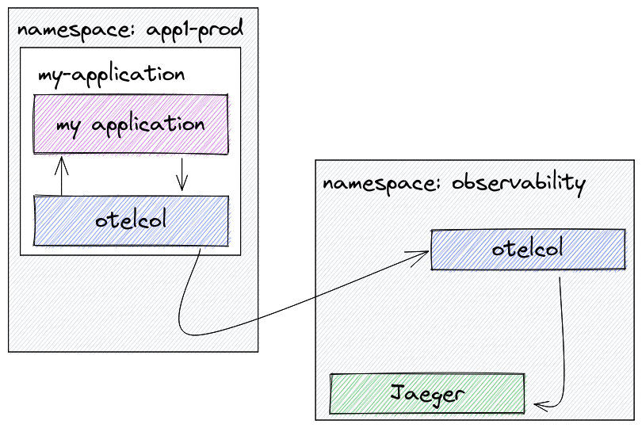

= Pattern #3 - Kubernetes

This pattern can be used when deploying the OpenTelemetry Collector on Kubernetes. It comes with the following variants:

- Agent as sidecar, where a container is added to the workload pod with the OpenTelemetry Collector. This instance is then configured to send data to an external collector, potentially in a different namespace or cluster.
- Agent as DaemonSet, where a DaemonSet is used instead, so that we have one agent pod per Kubernetes node. Note that this is not recommended for multitenant deployments, as the agent will receive data from all of the pods in the node, irrespective of namespace.

.Kubernetes pattern, with sidecars.

.Kubernetes pattern, with daemon sets.
image::daemonset.png[]

== Running

The blog post https://medium.com/opentelemetry/deploying-the-opentelemetry-collector-on-kubernetes-2256eca569c9["Deploying the OpenTelemetry Collector on Kubernetes"] shows in details how to achieve both scenarios. The https://github.com/open-telemetry/opentelemetry-operator/[OpenTelemetry Operator] can also be used for that, including the ability to inject sidecars into the workload pods automatically.
