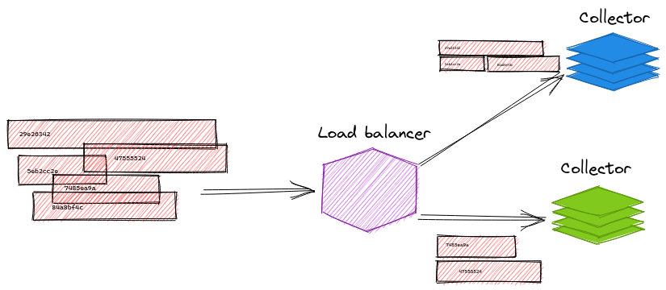

= Pattern #4 - Load balancing

Load balancing is an essential part of scenarios like tail-based sampling. In our context here, load balancing is taking in consideration the characteristics of the data point to decide where to send it. For example, we might want to apply a consistent hashing algorithm to a span in order to decide which backend should receive all spans from a specific trace.

Note that this is not related to regular load-balancing that can be done automatically by off-the-shelf tools.

.Load balancing based on trace IDs.

== Running

    otelcontribcol_linux_amd64 --config collector-1.yaml --metrics-addr :9888
    otelcontribcol_linux_amd64 --config collector-2.yaml --metrics-addr :10888
    otelcontribcol_linux_amd64 --config load-balancer.yaml
    tracegen -otlp-insecure -otlp-endpoint localhost:4317 -traces 1000

You can verify how many spans each collector receives by running the following commands. The first returns the number of spans exported by the load balancer, the others return the number of spans received by the individual collectors.

    curl -s localhost:8888/metrics | grep "^otelcol_exporter_sent_spans"
    curl -s localhost:9888/metrics | grep "^otelcol_receiver_accepted_spans"
    curl -s localhost:10888/metrics | grep "^otelcol_receiver_accepted_spans"

Here's an example output:

    otelcol_exporter_sent_spans{exporter="otlp",service_instance_id="22bedd2b-c224-4531-aa72-81f9fde05fd2"} 4000
    otelcol_receiver_accepted_spans{receiver="otlp",service_instance_id="5c1fda49-d560-44bf-a397-e990f348ea05",transport="grpc"} 2038
    otelcol_receiver_accepted_spans{receiver="otlp",service_instance_id="1afd70d6-4258-415c-84a5-071fdf4e1cb9",transport="grpc"} 1962