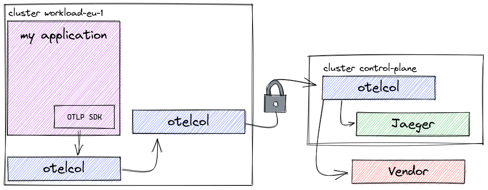

= Pattern #5 - Multi-cluster

At the basic level, this is not much different than the pattern #3, except that we might have one or more additional layers of collectors. In most cases, it would make sense to have at least three levels: agent, workload collector, and control plane collector.

It's worth mentioning that the communication between the workload and the control plane collector should be secured, both at the connection level (TLS) and at the message level (authentication).

The image does not include the authentication part, but in a typical setup, the clients (workload collectors) would obtain a token from an authentication server and send this token with every RPC to the control plane collector. This token is then validated by the control plane collector.

.Agent, workload, and control plane collectors.

== Running

Follow the blog post https://medium.com/opentelemetry/securing-your-opentelemetry-collector-1a4f9fa5bd6f["Securing your OpenTelemetry Collector"] in order to configure a suitable Keycloak instance for the authentication. When it says "agent", we'll translate to "workload" here, and when it says "collector", we'll translate to "control-plane". Once you have the clients configured, come back here and run the following commands:

    podman run -p 8080:8080 -e KEYCLOAK_USER=admin -e KEYCLOAK_PASSWORD=admin quay.io/keycloak/keycloak:15.0.2

    export CLIENT_SECRET=<your client secret>
    TOKEN=$(curl -s --data "grant_type=client_credentials&client_id=workload&client_secret=${CLIENT_SECRET}" http://localhost:8080/auth/realms/opentelemetry/protocol/openid-connect/token | jq -r .access_token)
    sed -i "s/token: .*$/token: '${TOKEN}'/" workload.yaml

    podman run -p 14250:14250 -p 16686:16686 jaegertracing/all-in-one:1.24 --log-level=debug
    otelcontribcol_linux_amd64 --config agent.yaml --metrics-addr :9888
    otelcontribcol_linux_amd64 --config workload.yaml --metrics-addr :10888
    otelcontribcol_linux_amd64 --config control-plane.yaml
    tracegen -otlp-insecure -otlp-endpoint localhost:4317 -traces 10

=== Generating the certificates

The certificates are generated using the following command:

    cfssl genkey -initca ca.csr | cfssljson -bare ca
    cfssl gencert -ca ca.pem -ca-key ca-key.pem control-plane.csr | cfssljson -bare control-plane
