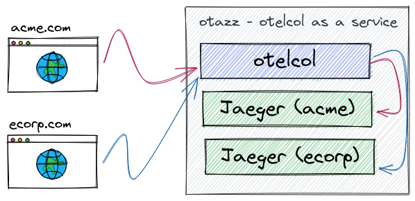

= Pattern #6 - Multitenant

In this setup, we have a centralized OpenTelemetry Collector instance controlling the ingress of all data points for all tenants. Tenancy is loosely defined here, and could be internal customers that need to be charged back for their usage, or external customers of a SaaS offering.

The OpenTelemetry Collector instance serving as the fronting service has a routing table, which maps data points to exporters. In our case, we are routing all tenants to their own Jaeger instance, but it's worth mentioning that tenants can have very different exporters if they so require: one tenant might be exported to Zipkin instead, while another might get exported to an external vendor.

The advantage of having an OpenTelemetry Collector here is that we can have a single logic to be applied to all data points before they are sent to their final destinations: cleaning up personally identifiable information, normalizing labels, performing authentication, etc.

.Two tenants, each with their own Jaeger.

== Running

    podman run --rm --name jaeger-acme -p 14250:14250 -p 16686:16686 jaegertracing/all-in-one:1.24 --log-level=debug
    podman run --rm --name jaeger-ecorp -p 15250:14250 -p 17686:16686 jaegertracing/all-in-one:1.24 --log-level=debug
    otelcontribcol_linux_amd64 --config acme.yaml --metrics-addr :9888
    otelcontribcol_linux_amd64 --config ecorp.yaml --metrics-addr :10888
    otelcontribcol_linux_amd64 --config otazz.yaml
    tracegen -otlp-insecure -otlp-endpoint localhost:5317 -traces 10
    tracegen -otlp-insecure -otlp-endpoint localhost:6317 -traces 10
