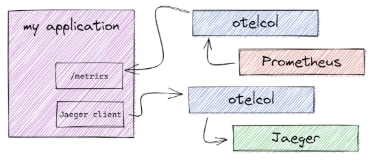

= Pattern #7 - Per signal

This is not exactly a pattern, but a tip that is close to a best practice: split your collector based on the signals it can receive. The workloads for each telemetry data type can vary heavily, as well as their stability in the OTel ecosystem. When you have one collector cluster per signal type, you can better scale them individually, as well as better isolate the failures affecting specific signals.

.Two collectors, one for each telemetry data type.

