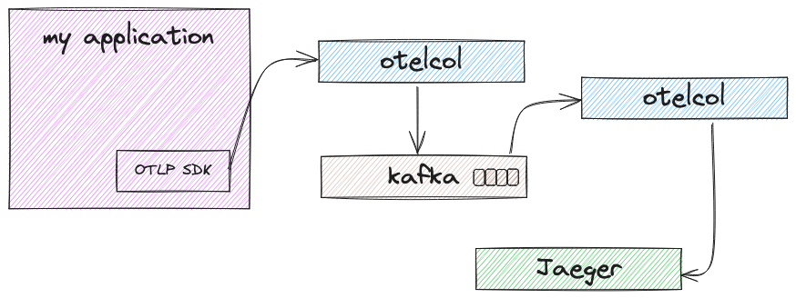

= Pattern #8 - Kafka

This pattern describes a scalable scenario for handling high volume of telemetry data. It's basic deployment setup consists of two levels of collectors and Kafka, where the first level is primarily used to receive telemetry data (e.g., via OTLP) and exporting them to Kafka (e.g, KafkaExporter) as fast as possible without concern about the telemetry data itself. The first level of collector is our producer level.
The second level of collector features our consumer level (e.g., KafkaReceiver) to consumes telemetry data from Kafka and export them to the telemetry backend (e.g., Jaeger). 

There are numerous benefits to send OpenTelemetry data to Kafka before sending it to the collector, including but not limited to:

- Decoupling and Buffering: Kafka acts as a buffer between the collector and the telemetry backend. This allows our telemetry data continue to be produced even if the backend is experiencing issues or the consumer level is temporarily unavailable.
- Scaling and throughput: Kafka is designed to be scalable. We can just add or remove brokers and also increase throughput by just resizing the number of partitions in a topic.
- Reliability: Kafka features exactly-once delivery method, meaning the telemetry data will be delivered to the collector in a reliable way without duplicates or data loss.

.Kafka broker, two collectors and Jaeger.

